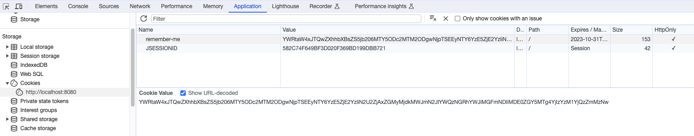
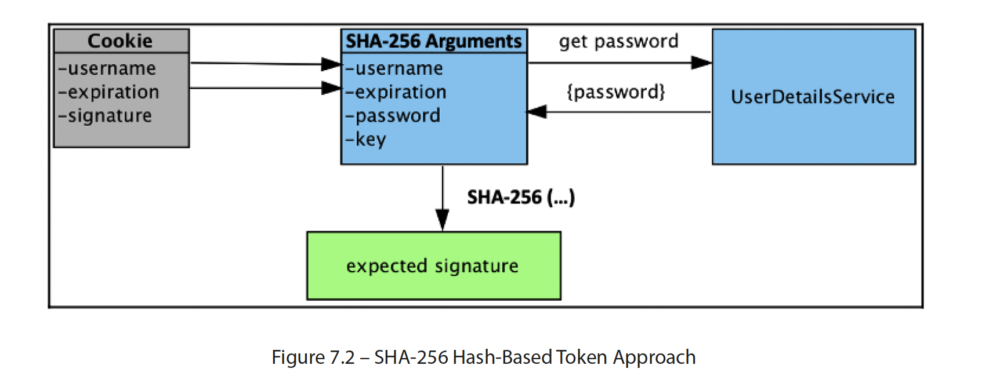
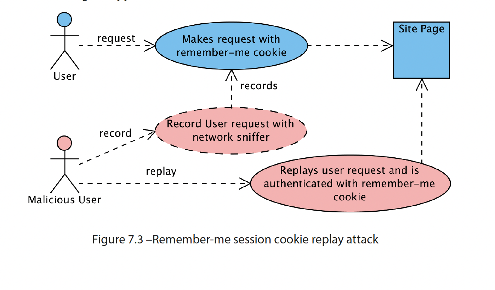

# Spring Security Remember-Me Nasıl Çalışır?

## Bölüm 1 — En Temel Kavramlar

### Sorun Nedir?

Bir web sitesine giriş yaptığını düşün. Kullanıcı adı ve şifreni yazıyorsun, site seni tanıyor. Ama tarayıcıyı kapatıp ertesi gün geri geldiğinde site seni unutmuş oluyor — tekrar şifre girmen gerekiyor.

**"Remember-me" (beni hatırla)** özelliği tam olarak bu sorunu çözer: Kullanıcı, tarayıcı kapansa bile hatırlanmayı *tercih edebilir*. Login formundaki o klasik "Beni hatırla" kutucuğu işte budur.

### Remember-Me Nedir?

Bir web sitesi seni nasıl hatırlar? Aslında HTTP tek başına bunu yapamaz. Çünkü HTTP "hafızasızdır"; sunucuya gelen her request, yeni bir request gibi değerlendirilir. Sen az önce login olmuş olsan bile, sayfayı yenilediğinde sunucunun bunun hâlâ sen olduğunu anlayabilmesi için ek bir bilgiye ihtiyacı vardır.

#### Cookie Neden Gereklidir?

Cookie tam bu noktada devreye girer. En basit hâliyle cookie, sunucunun tarayıcına bıraktığı küçük bir nottur. Tarayıcı daha sonraki request'lerde bu notu sunucuya geri gönderir.



Remember-me özelliğinin temel mantığı da buna dayanır:

* Login olurken "Remember Me" kutusunu işaretlersin.
* Spring Security tarayıcına bir remember-me cookie'si bırakır.
* Tarayıcıyı kapatıp daha sonra siteye döndüğünde bu cookie yeniden sunucuya gönderilir.
* Spring Security cookie'yi doğrular. Her şey yolundaysa şifreni tekrar sormadan seni otomatik olarak login eder.

## Bölüm 2 — Spring Security Remember-Me Stratejileri

Spring Security remember-me için iki farklı yaklaşım sunar:

| Strateji                                                    | Nasıl çalışır?                                               | Ekstra gereksinim   |
| ----------------------------------------------------------- | ----------------------------------------------------------------- | ------------------- |
| **Token-based** (imza tabanlı)                       | Cookie'nin içine kriptografik bir imza koyar.                    | Yok                 |
| **Persistent-based** (kalıcı, veritabanı tabanlı) | Cookie'deki bilgiyi veritabanındaki kayıtla karşılaştırır. | Veritabanı gerekir |

> **Küçük ama önemli bir not:** Remember-me kendiliğinden aktif olmaz. Kullanabilmek için Spring Security yapılandırmasında açıkça etkinleştirmen gerekir.

## Bölüm 3 — Token-Based Remember-Me Akışı

İşin kod tarafında `http.rememberMe(...)` yapılandırması bir `TokenBasedRememberMeServices` oluşturur. Bundan sonrası iki ayrı zamanda gerçekleşen iki akıştan oluşur: İlkinde cookie oluşturulur, ikincisinde bu cookie kullanılarak kullanıcı hatırlanır.

### Akış 1: Login — Cookie Oluşturma (`onLoginSuccess`)

```text
Login başarılı
→ Kullanıcı bilgileri alınır
→ Son kullanma tarihi hesaplanır
→ İmza oluşturulur
→ Remember-me cookie tarayıcıya yazılır
```

> **Buradaki kritik nokta şu:** Şifre cookie'nin içine yazılmaz; yalnızca imza hesaplanırken kullanılır. Bu yüzden kullanıcı şifresini değiştirdiğinde eski remember-me cookie'leri de kendiliğinden geçersiz olur.

Önce normal login anına bakalım. Kullanıcı "Remember Me" kutusunu işaretlediyse başarılı authentication sonrasında `onLoginSuccess(...)` çağrılır. Metot sırasıyla şunları yapar:

1. **Kullanıcı adını alır:** Bunun için `retrieveUserName` kullanılır. Kullanıcı adı bulunamazsa remember-me cookie'si oluşturulmaz; fakat normal login bundan etkilenmez.
2. **Şifreyi alır:** Önce `retrievePassword` ile `Authentication` nesnesine bakılır. Şifre burada yoksa `UserDetailsService` üzerinden yüklenir. Şifre yine bulunamazsa cookie oluşturma işlemi sonlandırılır.
3. **Son kullanma tarihini hesaplar:** Şimdiki zamana token'ın geçerlilik süresi eklenir. Bu süre varsayılan olarak 14 gündür.
4. **İmzayı üretir:** Kullanıcı adı, son kullanma tarihi, şifre ve yalnızca sunucunun bildiği `key` bir araya getirilir.

   ```java
   protected String makeTokenSignature(long tokenExpiryTime, String username, String password,
           RememberMeTokenAlgorithm algorithm) {
       String data = username + ":" + tokenExpiryTime + ":" + password + ":" + getKey();
       try {
           MessageDigest digest = MessageDigest.getInstance(algorithm.getDigestAlgorithm());
           return new String(Hex.encode(digest.digest(data.getBytes())));
       }
       catch (NoSuchAlgorithmException ex) {
           throw new IllegalStateException("No " + algorithm.name() + " algorithm available!");
       }
   }
   ```
5. **Cookie'yi yazar:** Son olarak aşağıdaki dört parça birleştirilir ve HTTP response ile tarayıcıya gönderilir:

   ```text
   username : expiryTime : SHA256 : imza
   ```

   Buradaki üçüncü parça, kullanılan imza algoritmasının adıdır. Cookie daha sonra geri geldiğinde Spring Security imzayı hangi algoritmayla doğrulayacağını bu alandan anlar.

### Akış 2: Sonraki Ziyaret — Cookie Doğrulama (`processAutoLoginCookie`)

```text
Tarayıcı cookie'yi gönderir
→ Cookie'nin süresi kontrol edilir
→ Kullanıcı bulunur
→ İmza yeniden hesaplanır
→ İmzalar karşılaştırılır
→ İmza doğruysa otomatik giriş yapılır
```

Şimdi aradan biraz zaman geçtiğini ve kullanıcının siteye yeniden geldiğini düşünelim. Kullanıcı bu kez username ve password girmiyor; tarayıcı daha önce kaydettiği remember-me cookie'sini gönderiyor. `processAutoLoginCookie(...)` bu cookie'yi şu sırayla kontrol ediyor:

1. Kullanıcı siteye yeniden gelir.
2. Tarayıcı daha önce kaydettiği remember-me cookie'sini gönderir.
3. Spring Security önce cookie'nin süresini kontrol eder.
   - Süresi dolmuşsa giriş yapılmaz.
   - Süresi dolmamışsa işleme devam edilir.
4. Ardından cookie'deki username ile kullanıcıyı bulur.
5. Kullanıcının güncel password bilgisiyle cookie imzasını yeniden hesaplar.
6. Yeni hesaplanan imzayı cookie'den gelen imzayla karşılaştırır.
   - İmzalar aynıysa kullanıcı otomatik olarak giriş yapar.
   - İmzalar farklıysa cookie geçersiz kabul edilir.



## Bölüm 4 — Remember-Me Mimarisi

Buraya kadar cookie'yi oluşturan ve doğrulayan metotlara baktık. Peki bir HTTP request geldiğinde `processAutoLoginCookie(...)` metoduna nasıl ulaşılıyor? Bu işi üç temel bileşen birlikte yürütüyor:

```text
Filter → Services → Token
```

### `RememberMeAuthenticationFilter`

İlk durak `RememberMeAuthenticationFilter`'dır. Bu filter, request'i Spring Security filter chain içinde karşılar. Kullanıcının hâlihazırda bir authentication bilgisi yoksa `RememberMeServices` bileşenine şu soruyu sorar: "Bu kullanıcıyı remember-me cookie'siyle tanıyabilir miyiz?"

### `RememberMeServices`

Asıl cookie kontrolü burada yapılır:

* Cookie yoksa özel bir işlem yapmadan filter chain'e devam edilir.
* Cookie varsa önce çözülür, ardından doğrulanır.
* `TokenBasedRememberMeServices` imzayı karşılaştırır.
* `PersistentTokenBasedRememberMeServices` veritabanındaki kaydı kontrol eder.

Cookie çözülemez veya doğrulanamazsa otomatik login yapılmaz ve cookie geçersiz kabul edilir.

### `RememberMeAuthenticationToken`

Cookie doğrulandıktan sonra geriye kullanıcıyı Spring Security içinde temsil etmek kalır. Bunun için bir `RememberMeAuthenticationToken` oluşturulur. Böylece kullanıcı password girmeden, remember-me üzerinden authentication kazanmış olur.

## Bölüm 5 — Remember-Me Güvenli mi?

Remember-me oldukça kullanışlıdır; ama bu kolaylığın bir bedeli vardır. Cookie başka birinin eline geçerse, geçerlilik süresi dolana kadar kullanıcı yerine kullanılabilir.



### Cookie Replay Riski

Basit bir senaryo düşünelim:

1. Kullanıcı remember-me cookie'siyle siteye bir request gönderir.
2. Saldırgan bir şekilde bu cookie'yi ele geçirir.
3. Cookie'yi kendi request'ine ekleyip yeniden gönderir.
4. Cookie hâlâ geçerliyse sistem bu isteği gerçek kullanıcıdan gelmiş gibi kabul edebilir.

Burada saldırgan cookie'nin anlamını değiştirmiyor veya `key` değerini kırmıyor. Zaten geçerli olan cookie'yi olduğu gibi yeniden kullanıyor. Bu yüzden buna replay deniyor.

### HTTPS ve XSS Önlemleri

Bu riski tek bir ayarla tamamen ortadan kaldırmak mümkün değil. Bunun yerine birkaç önlem birlikte kullanılmalı:

* **HTTPS:** Trafiği şifreler ve cookie'nin ağ dinlenerek ele geçirilmesini zorlaştırır.
* **HttpOnly:** JavaScript'in cookie'ye doğrudan erişmesini sınırlar. Böylece bazı XSS senaryolarında cookie'nin çalınması zorlaşır.
* **Secure:** Cookie'nin yalnızca HTTPS bağlantısı üzerinden gönderilmesini sağlar.
* **SameSite:** Cookie'nin cross-site request'lerde hangi koşullarda gönderileceğini sınırlar.

Yine de HTTPS kullanmak, uygulamadaki bütün açıkları kapatmaz. Özellikle XSS gibi saldırılara karşı uygulama tarafında ayrıca önlem almak gerekir.

## Bölüm 6 — Akılda Kalması Gerekenler

Bu yazıdan dört şeyi hatırlamak yeterli:

1. **Şifre tarayıcıya gönderilmez:** Yalnızca imza hesaplanırken kullanılır.
2. **Token kendi kendini doğrular:** Token-based yöntemde ayrıca bir token kaydı tutulmaz. Sunucu imzayı yeniden hesaplayıp cookie'yi kontrol eder.
3. **Token'ları geçersiz kılmak mümkündür:** Password değişirse o kullanıcıya ait eski cookie'ler, uygulamanın `key` değeri değişirse tüm kullanıcıların cookie'leri geçersiz olur.
4. **Süreç iki ayrı akıştan oluşur:** İlk login sırasında cookie oluşturulur; sonraki ziyarette bu cookie doğrulanarak otomatik login yapılır.
